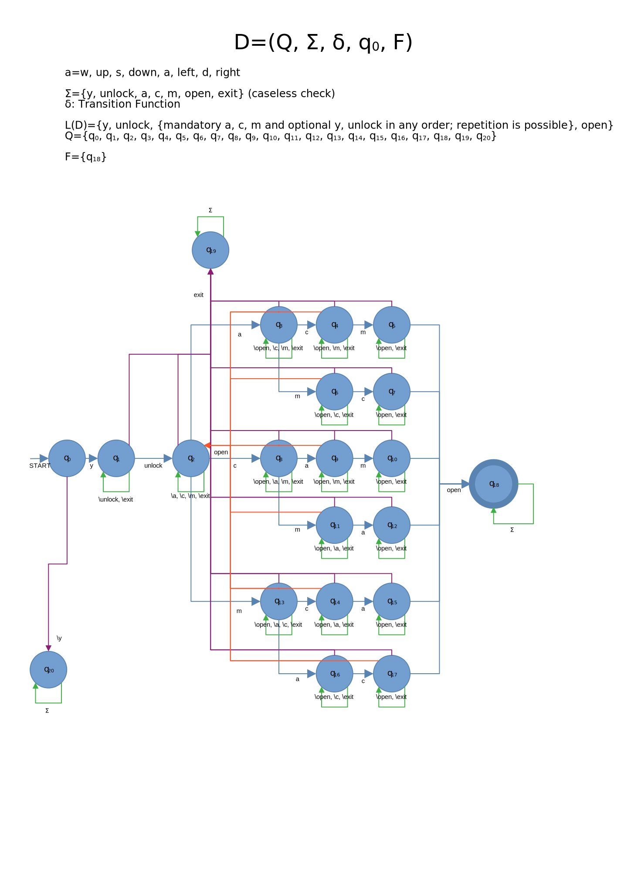

# Secret door logic (boolean secretDoorUnlocked)

## General description

The secret door logic is triggered when `<boolean> secretDoorUnlocked` is true and will replace the map with an empty map containing a dutch flag. It will also replace the green player symbol with a blue one.

The `<boolean> secretDoorUnlocked` is true if the player supplies the following input in order:
1. `y` (caseless check)
2. Nothing OR anything other than `exit` (caseless check)
3. `unlock` (caseless check)
4. Nothing OR anything other than `exit` (caseless check)
5. Mandatory `a`, `c` AND `m` plus optional `y` AND/OR `unlock` in any order (caseless check, repetition is possible)
6. Nothing OR anything other than `exit` (caseless check)
7. `open` (caseless check)

After point 7, the `<boolean> secretDoorUnlocked` is true and the secret door logic triggers.

## Automaton

### Table

| State                 | y        | unlock   | a        | c        | m        | open     | exit     |
| --------------------- | -------- | -------- | -------- | -------- | -------- | -------- | -------- |
| $^{\rightarrow}q_{0}$ | $q_{1}$  | $q_{20}$ | $q_{20}$ | $q_{20}$ | $q_{20}$ | $q_{20}$ | $q_{20}$ |
| $q_{1}$               | $q_{1}$  | $q_{2}$  | $q_{1}$  | $q_{1}$  | $q_{1}$  | $q_{1}$  | $q_{19}$ |
| $q_{2}$               | $q_{2}$  | $q_{2}$  | $q_{3}$  | $q_{8}$  | $q_{13}$ | $q_{2}$  | $q_{19}$ |
| $q_{3}$               | $q_{3}$  | $q_{3}$  | $q_{3}$  | $q_{4}$  | $q_{6}$  | $q_{2}$  | $q_{19}$ |
| $q_{4}$               | $q_{4}$  | $q_{4}$  | $q_{4}$  | $q_{4}$  | $q_{5}$  | $q_{2}$  | $q_{19}$ |
| $q_{5}$               | $q_{5}$  | $q_{5}$  | $q_{5}$  | $q_{5}$  | $q_{5}$  | $q_{18}$ | $q_{19}$ |
| $q_{6}$               | $q_{6}$  | $q_{6}$  | $q_{6}$  | $q_{7}$  | $q_{6}$  | $q_{2}$  | $q_{19}$ |
| $q_{7}$               | $q_{7}$  | $q_{7}$  | $q_{7}$  | $q_{7}$  | $q_{7}$  | $q_{18}$ | $q_{19}$ |
| $q_{8}$               | $q_{8}$  | $q_{8}$  | $q_{9}$  | $q_{8}$  | $q_{11}$ | $q_{2}$  | $q_{19}$ |
| $q_{9}$               | $q_{9}$  | $q_{9}$  | $q_{9}$  | $q_{9}$  | $q_{10}$ | $q_{2}$  | $q_{19}$ |
| $q_{10}$              | $q_{10}$ | $q_{10}$ | $q_{10}$ | $q_{10}$ | $q_{10}$ | $q_{18}$ | $q_{19}$ |
| $q_{11}$              | $q_{11}$ | $q_{11}$ | $q_{12}$ | $q_{11}$ | $q_{11}$ | $q_{2}$  | $q_{19}$ |
| $q_{12}$              | $q_{12}$ | $q_{12}$ | $q_{12}$ | $q_{12}$ | $q_{12}$ | $q_{18}$ | $q_{19}$ |
| $q_{13}$              | $q_{13}$ | $q_{13}$ | $q_{16}$ | $q_{14}$ | $q_{13}$ | $q_{1}$  | $q_{19}$ |
| $q_{14}$              | $q_{14}$ | $q_{14}$ | $q_{15}$ | $q_{14}$ | $q_{14}$ | $q_{2}$  | $q_{19}$ |
| $q_{15}$              | $q_{15}$ | $q_{15}$ | $q_{15}$ | $q_{15}$ | $q_{15}$ | $q_{18}$ | $q_{19}$ |
| $q_{16}$              | $q_{16}$ | $q_{16}$ | $q_{16}$ | $q_{17}$ | $q_{16}$ | $q_{2}$  | $q_{19}$ |
| $q_{17}$              | $q_{17}$ | $q_{17}$ | $q_{17}$ | $q_{17}$ | $q_{17}$ | $q_{18}$ | $q_{19}$ |
| $^{*}q_{18}$          | $q_{18}$ | $q_{18}$ | $q_{18}$ | $q_{18}$ | $q_{18}$ | $q_{18}$ | $q_{18}$ |
| $q_{19}$              | $q_{19}$ | $q_{19}$ | $q_{19}$ | $q_{19}$ | $q_{19}$ | $q_{19}$ | $q_{19}$ |
| $q_{20}$              | $q_{20}$ | $q_{20}$ | $q_{20}$ | $q_{20}$ | $q_{20}$ | $q_{20}$ | $q_{20}$ |