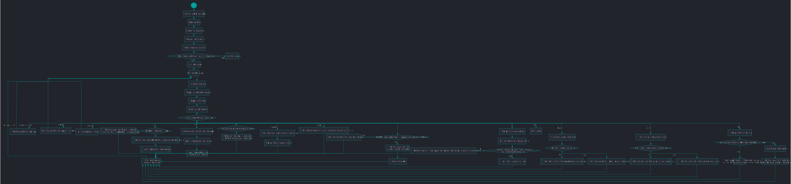

# class JavaCraft

## Pseudocode

```java
BEGIN

Define global constants/variables and assign values to some;
Initialize game by assigning some global variables;
Generate world with different blocks by using randomness;
PRINT INFO `instructions`;
PRINT INFO "Start the game? (Y/N): ";
IF `<String> READ user input` == y (caseless check)
    Set `<boolean> unlockMode` = false;
    Set `<boolean> craftingCommandEntered` = false;
    Set `<boolean> miningCommandEntered` = false;
    Set `<boolean> movementCommandEntered` = false;
    WHILE true
        PRINT INFO `initial UI containing legend, world, inventory`;
        PRINT INFO "Enter your action: 'WASD': Move, 'M': Mine, 'P': Place, 'C': Craft, 'I': Interact, 'Save': Save, 'Load': Load, 'Exit': Quit, 'Unlock': Unlock Secret Door\n" (colored in green);
        IF `<String> READ user input` == "w" OR "up" OR "s" OR "down" OR "a" OR "left" OR "d" OR "right" (caseless check)
            IF `<boolean> unlockMode` == true
                Set `<boolean> movementCommandEntered` = true;
            Move player;
        ELSE IF `<String> READ user input` == "m" (caseless check)
            IF `<boolean> unlockMode` == true
                Set `<boolean> miningCommandEntered` = true;
            Mine block;
        ELSE IF `<String> READ user input` == "p" (caseless check)
            PRINT INFO `players inventory`;
            PRINT INFO "Enter the block type to place: ";
            Place block `<String> READ user input`;
        ELSE IF `<String> READ user input` == "c" (caseless check)
            PRINT INFO `crafting recipes`;
            PRINT INFO "Enter the recipe number to craft: ";
            Craft item `<String> READ user input`;
        ELSE IF `<String> READ user input` == "i" (caseless check)
            Interact with world;
        ELSE IF `<String> READ user input` == "save" (caseless check)
            PRINT INFO "Enter the file name to save the game state: ";
            Save game as `<String> READ user input`;
        ELSE IF `<String> READ user input` == "load" (caseless check)
            PRINT INFO "Enter the file name to load the game state: ";
            Load game from `<String> READ user input`;
        ELSE IF `<String> READ user input` == "exit" (caseless check)
            PRINT INFO "Exiting the game. Goodbye!\n";
            Exit game;
        ELSE IF `<String> READ user input` == "look" (caseless check)
            Print all blocks sorrounding player;
        ELSE IF `<String> READ user input` == "unlock" (caseless check)
            Set `<boolean> unlockMode` = true;
        ELSE IF `<String> READ user input` == "getflag" (caseless check)
            TRY TO
                Set up connection to a server;
                PRINT INFO " " + `<String> get country from server via a POST request`;
                PRINT INFO " " + `<String> get quote from server via a POST request`;
            ON EXCEPTION
                PRINT ERROR containing `stacktrace`;
                PRINT ERROR "Error connecting to the server";
            Wait on player to press ENTER;
        ELSE IF `<String> READ user input` == "open" (caseless check)
            IF `<boolean> unlockMode` == true AND `<boolean> craftingCommandEntered` == true AND `<boolean> miningCommandEntered` == true AND `<boolean> movementCommandEntered` == true
                Set `<boolean> secretDoorUnlocked` = true;
                Reset world to an empty world;
                PRINT INFO "Secret door unlocked!\n";
                Wait on player to press ENTER;
            ELSE
                PRINT WARNING "Invalid passkey. Try again!\n";
                Set `<boolean> unlockMode` = false;
                Set `<boolean> craftingCommandEntered` = false;
                Set `<boolean> miningCommandEntered` = false;
                Set `<boolean> movementCommandEntered` = false;
        ELSE
            PRINT WARNING "Invalid input. Please try again." (colored in yellow);
        IF `<boolean> unlockMode` == true
            IF `<String> READ user input` == "c" (caseless check)
                Set `<boolean> craftingCommandEntered` = true;
            IF `<String> READ user input` == "m" (caseless check)
                Set `<boolean> miningCommandEntered` = true;
        IF `<boolean> secretDoorUnlocked` == true
            Clear screen;
            PRINT INFO "You have entered the secret area!\n";
            PRINT INFO "You are now presented with a game board with a flag!\n";
            Set `<boolean> inSecretArea` = true;
            Reset world to an empty world;
            Set `<boolean> secretDoorUnlocked` = false;
            Fill `<Integer list> inventory` with all available blockTypes;
            Wait on player to press ENTER;
ELSE
    Exit game;

END
```

## Flowchart


