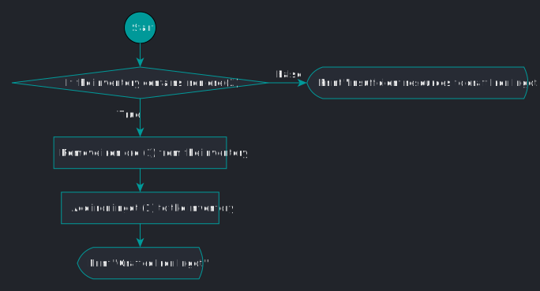

# void craftIronIngot()

## Java

```java
public static void craftIronIngot() {
    if (inventoryContains(IRON_ORE, 3)) {
        removeItemsFromInventory(IRON_ORE, 3);
        addCraftedItem(CRAFTED_IRON_INGOT);
        System.out.println("Crafted Iron Ingot.");
    } else {
        System.out.println("Insufficient resources to craft Iron Ingot.");
    }
}
```

## Pseudocode

```java
BEGIN

IF `<list> inventory` contains at least 3 iron ore
    Remove 3 iron ore from `<list> inventory`;
    Add the crafted item 1 iron ingot to `<list> inventory`;
    PRINT INFO "Crafted Iron Ingot.\n";
ELSE
    PRINT WARNING "Insufficient resources to craft Iron Ingot.\n";

END
```

## Flowchart


