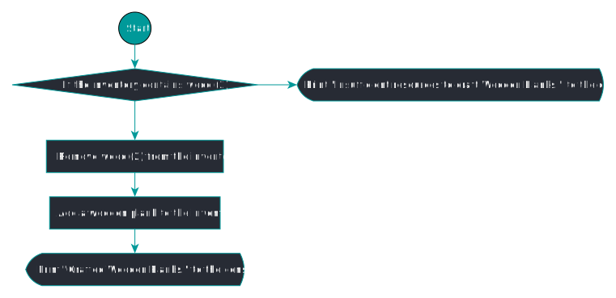

# void craftWoodenPlanks()

## Java

```java
public static void craftWoodenPlanks() {
    if (inventoryContains(WOOD, 2)) {
        removeItemsFromInventory(WOOD, 2);
        addCraftedItem(CRAFTED_WOODEN_PLANKS);
        System.out.println("Crafted Wooden Planks.");
    } else {
        System.out.println("Insufficient resources to craft Wooden Planks.");
    }
}
```

## Pseudocode

```java
BEGIN

IF `<list> inventory` contains at least 2 wood
    Remove 2 wood from `<list> inventory`;
    Add the crafted item 1 wooden planks to `<list> inventory`;
    PRINT INFO "Crafted Wooden Planks.\n";
ELSE
    PRINT WARNING "Insufficient resources to craft Wooden Planks.\n";

END
```

## Flowchart


