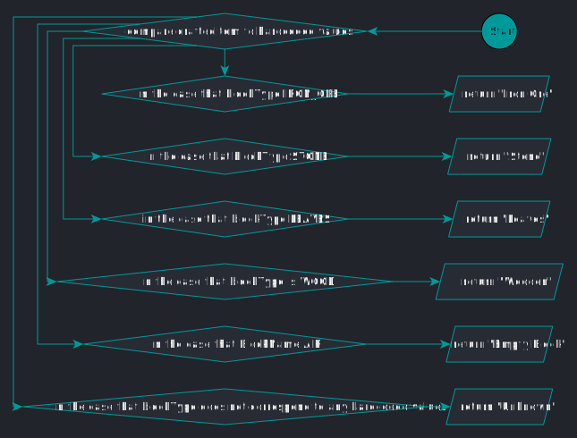

# String getCraftedItemName(int craftedItem)

## Java

```java
private static String getCraftedItemName(int craftedItem) {
    switch (craftedItem) {
        case CRAFTED_WOODEN_PLANKS:
            return "Wooden Planks";
        case CRAFTED_STICK:
            return "Stick";
        case CRAFTED_IRON_INGOT:
            return "Iron Ingot";
        case CRAFTED_STONE_PICKAXE:
            return "Stone Pickaxe";
        case CRAFTED_IRON_PICKAXE:
            return "Iron Pickaxe";
        default:
            return "Unknown";
    }
}
```

## Pseudocode

```java
BEGIN

IF `<Integer> craftedItem` == `<Integer> wooden planks`
    RETURN `<String> "Wooden Planks"`;
ELSE IF `<Integer> blockType` == `<Integer> stick`
    RETURN `<String> "Stick"`;
ELSE IF `<Integer> blockType` == `<Integer> iron ingot`
    RETURN `<String> "Iron Ingot"`;
ELSE IF `<Integer> blockType` == `<Integer> stone pickaxe`
    RETURN `<String> "Stone Pickaxe"`;
ELSE IF `<Integer> blockType` == `<Integer> iron pickaxe`
    RETURN `<String> "Iron Pickaxe"`;
ELSE
    RETURN `<String> "Unknown"`

END
```

## Flowchart


