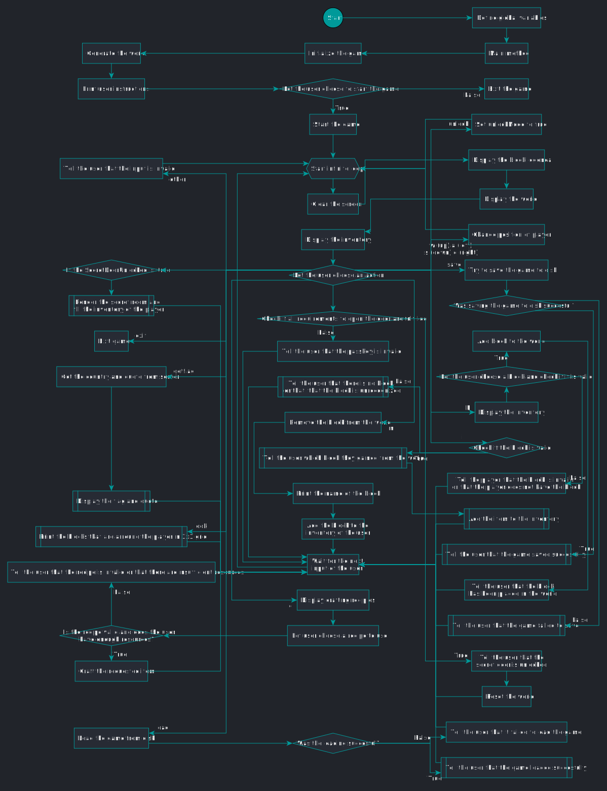
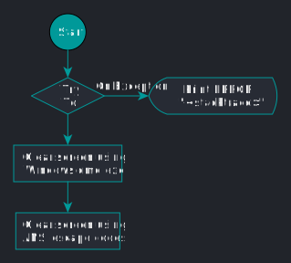
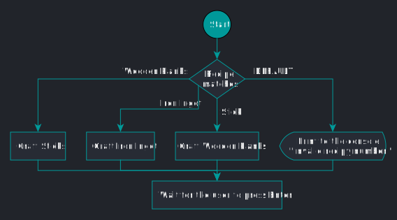
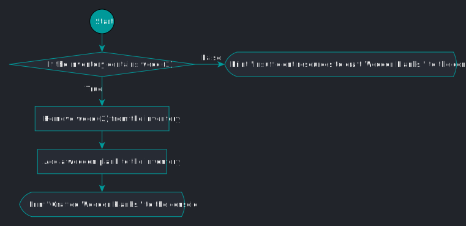
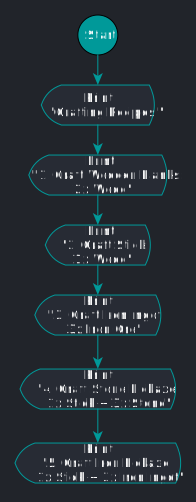
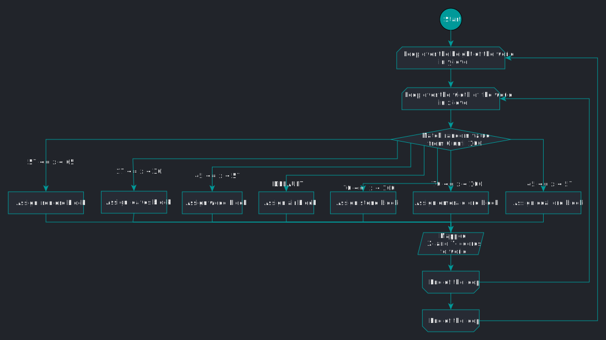
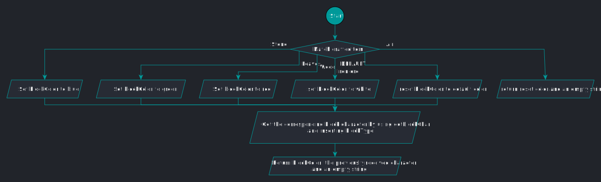
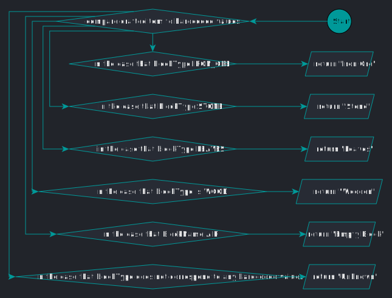

<script type="text/javascript"
    src="https://cdnjs.cloudflare.com/ajax/libs/mathjax/2.7.0/MathJax.js?config=TeX-AMS_CHTML">
</script>
<script type="text/x-mathjax-config">
    MathJax.Hub.Config({
        tex2jax: {
            inlineMath: [['$','$'], ['\\(','\\)']],
            processEscapes: true
        },
        jax: ["input/TeX","input/MathML","input/AsciiMath","output/CommonHTML"],
        extensions: ["tex2jax.js","mml2jax.js","asciimath2jax.js","MathMenu.js","MathZoom.js","AssistiveMML.js", "[Contrib]/a11y/accessibility-menu.js"],
        TeX: {
            extensions: ["AMSmath.js","AMSsymbols.js","noErrors.js","noUndefined.js"],
            equationNumbers: {
                autoNumber: "AMS"
            }
        }
    });
</script>

# Tacita’s JavaCraft - Provisional Report (Group 18)

## Table of Contents

1. [Tacita’s JavaCraft - Provisional Report (Group 18)](#tacitas-javacraft---provisional-report-group-18)
   1. [Table of Contents](#table-of-contents)
   2. [Group Details](#group-details)
      1. [Students](#students)
   3. [Introduction](#introduction)
   4. [JavaCraft’s Workflow](#javacrafts-workflow)
      1. [Class JavaCraft](#class-javacraft)
   5. [Functionality Exploration](#functionality-exploration)
      1. [Documentation of functions](#documentation-of-functions)
      2. [Additional Info](#additional-info)
   6. [Finite State Automata (FSA) Design](#finite-state-automata-fsa-design)
      1. [Secret door logic (boolean secretDoorUnlocked)](#secret-door-logic-boolean-secretdoorunlocked)
   7. [Git Collaboration \& Version Control](#git-collaboration--version-control)
      1. [Overview](#overview)
      2. [Who did what?](#who-did-what)
   8. [Appendix](#appendix)
      1. [void clearScreen()](#void-clearscreen)
      2. [void craftIronIngot()](#void-craftironingot)
      3. [void craftItem(int recipe)](#void-craftitemint-recipe)
      4. [void craftStick()](#void-craftstick)
      5. [void craftWoodenPlanks()](#void-craftwoodenplanks)
      6. [void displayCraftingRecipes()](#void-displaycraftingrecipes)
      7. [void displayInventory()](#void-displayinventory)
      8. [void fillInventory()](#void-fillinventory)
      9. [void generateWorld()](#void-generateworld)
      10. [char getBlockChar(int blockType)](#char-getblockcharint-blocktype)
      11. [String getBlockName(int blockType)](#string-getblocknameint-blocktype)
      12. [String getBlockSymbol(int blockType)](#string-getblocksymbolint-blocktype)
      13. [String getCraftedItemName(int craftedItem)](#string-getcrafteditemnameint-crafteditem)
      14. [void loadGame(String fileName)](#void-loadgamestring-filename)
      15. [void lookAround()](#void-lookaround)
      16. [void placeBlock(int blockType)](#void-placeblockint-blocktype)
   9. [References](#references)


## Group Details

<table>
  <tr>
    <th>Group Name</th>
    <td>Tacita</td>
  </tr>
  <tr>
    <th>Group Number</th>
    <td>18</td>
  </tr>
  <tr>
    <th>TA</th>
    <td>TA assigned to Group 18</td>
  </tr>
</table>

### Students

| Student Name    | Student ID |
| --------------- | ---------- |
| Leopold Meinel  | i6352276   |
| Anton Haarmann  | i6367288   |
| Sian Lodde      | i6343174   |
| Tristan Dormans | i6343359   |

### Who Did What

|Task|Who worked on the task|Participation in percentages|
| --------------- | ---------- | ------- |
|Creating the initial pseudocode and flowcharts| Leopold <br> Anton <br> Tristan <br> Sian | Even across all participants|
|Setting up the Gitlab repository|Leopold|100%|
|Creating the documentation for the JavaCraft code|Leopold <br> Anton <br> Tristan <br> Sian| Even across all participants|
|Creating the flowchart and pseudocode for the global game| Tristan| 100%|
|Creating FSA for automaton|Leopold Tristan| 90% <br> 10%|
|Creating the table for automaton|Leopold| 100%|
|Converting ODF Flowcharts to .graphml|Tristan|100%|
|Deciding on the uniform format for the flowcharts|Leopold <br> Anton <br> Tristan <br> Sian|Even across all participants|
|Deciding on the uniform format for the pseudocode|Leopold <br> Anton <br> Tristan <br> Sian|90% <br> 10%|
|Converting flowcharts to uniform format| Sian <br> Tristan| 85% <br> 15%|
|Converting pseudocode to uniform format| Leopold|100%|
|Updating the documentation|Leopold|100%|
|Cleaning up the repository folders|Sian|100%|
|Exporting flowcharts to SVG format|Sian|100%|
|Implenting two blocks and two crafting items to the game|Anton|100%|
|Updating the functions involved with new blocks and crafting items|Anton|100%|
|Creating the provisional report document|Anton|100%|
|Merging the flowchart images with the report document int one PDF|Sian|100%|
|Setting repository naming of folders to industry standard|Leopold|100%|

<div style="page-break-after: always;"></div>

## JavaCraft’s Workflow

<!---
Start ./classes/description-JavaCraft.md
-->
### Class JavaCraft

#### Pseudocode

```java
BEGIN

Define global constants/variables and assign values to some;
Initialize game by assigning some global variables;
Generate world with different blocks by using randomness;
PRINT INFO `instructions`;
PRINT INFO "Start the game? (Y/N): ";
IF `<String> READ user input` == y (caseless check)
    Set `<boolean> unlockMode` = false;
    Set `<boolean> craftingCommandEntered` = false;
    Set `<boolean> miningCommandEntered` = false;
    Set `<boolean> movementCommandEntered` = false;
    WHILE true
        PRINT INFO `initial UI containing legend, world, inventory`;
        PRINT INFO "Enter your action: 'WASD': Move, 'M': Mine, 'P': Place, 'C': Craft, 'I': Interact, 'Save': Save, 'Load': Load, 'Exit': Quit, 'Unlock': Unlock Secret Door\n" (colored in green);
        IF `<String> READ user input` == "w" OR "up" OR "s" OR "down" OR "a" OR "left" OR "d" OR "right" (caseless check)
            IF `<boolean> unlockMode` == true
                Set `<boolean> movementCommandEntered` = true;
            Move player;
        ELSE IF `<String> READ user input` == "m" (caseless check)
            IF `<boolean> unlockMode` == true
                Set `<boolean> miningCommandEntered` = true;
            Mine block;
        ELSE IF `<String> READ user input` == "p" (caseless check)
            PRINT INFO `players inventory`;
            PRINT INFO "Enter the block type to place: ";
            Place block `<String> READ user input`;
        ELSE IF `<String> READ user input` == "c" (caseless check)
            PRINT INFO `crafting recipes`;
            PRINT INFO "Enter the recipe number to craft: ";
            Craft item `<String> READ user input`;
        ELSE IF `<String> READ user input` == "i" (caseless check)
            Interact with world;
        ELSE IF `<String> READ user input` == "save" (caseless check)
            PRINT INFO "Enter the file name to save the game state: ";
            Save game as `<String> READ user input`;
        ELSE IF `<String> READ user input` == "load" (caseless check)
            PRINT INFO "Enter the file name to load the game state: ";
            Load game from `<String> READ user input`;
        ELSE IF `<String> READ user input` == "exit" (caseless check)
```

<div style="page-break-after: always;"></div>

```java
            PRINT INFO "Exiting the game. Goodbye!\n";
            Exit game;
        ELSE IF `<String> READ user input` == "look" (caseless check)
            Print all blocks sorrounding player;
        ELSE IF `<String> READ user input` == "unlock" (caseless check)
            Set `<boolean> unlockMode` = true;
        ELSE IF `<String> READ user input` == "getflag" (caseless check)
            TRY TO
                Set up connection to a server;
                PRINT INFO " " + `<String> get country from server via a POST request`;
                PRINT INFO " " + `<String> get quote from server via a POST request`;
            ON EXCEPTION
                PRINT ERROR containing `stacktrace`;
                PRINT ERROR "Error connecting to the server";
            Wait on player to press ENTER;
        ELSE IF `<String> READ user input` == "open" (caseless check)
            IF `<boolean> unlockMode` == true AND `<boolean> craftingCommandEntered` == true AND `<boolean> miningCommandEntered` == true AND `<boolean> movementCommandEntered` == true
                Set `<boolean> secretDoorUnlocked` = true;
                Reset world to an empty world;
                PRINT INFO "Secret door unlocked!\n";
                Wait on player to press ENTER;
            ELSE
                PRINT WARNING "Invalid passkey. Try again!\n";
                Set `<boolean> unlockMode` = false;
                Set `<boolean> craftingCommandEntered` = false;
                Set `<boolean> miningCommandEntered` = false;
                Set `<boolean> movementCommandEntered` = false;
        ELSE
            PRINT WARNING "Invalid input. Please try again." (colored in yellow);
        IF `<boolean> unlockMode` == true
            IF `<String> READ user input` == "c" (caseless check)
                Set `<boolean> craftingCommandEntered` = true;
            IF `<String> READ user input` == "m" (caseless check)
                Set `<boolean> miningCommandEntered` = true;
        IF `<boolean> secretDoorUnlocked` == true
            PRINT INFO `description of current state`;
            Set `<boolean> inSecretArea` = true;
            Reset world to an empty world;
            Set `<boolean> secretDoorUnlocked` = false;
            Fill `<Integer list> inventory` with all available blockTypes;
            Wait on player to press ENTER;
ELSE
    Exit game;

END
```

<div style="page-break-after: always;"></div>

#### Flowchart


<!---
End ./classes/description-JavaCraft.md
-->

## Functionality Exploration

### Documentation of functions

<!---
Start ./docs/JavaCraft-edit.html
-->

<!---
End ./docs/JavaCraft-edit.html
-->

### Additional Info

See [Appendix](#appendix) for flowcharts and pseudocodes of 16 functions.

## Finite State Automata (FSA) Design

<!---
Start ./automata/secretDoorUnlocked.md
-->
### Secret door logic (boolean secretDoorUnlocked)

#### General description

The secret door logic is triggered when `<boolean> secretDoorUnlocked` is true and will replace the map with an empty map containing a dutch flag. It will also replace the green player symbol with a blue one.

The `<boolean> secretDoorUnlocked` is true if the player supplies the following input in order:
1. `y` (caseless check)
2. Nothing OR anything other than `exit` (caseless check)
3. `unlock` (caseless check)
4. Nothing OR anything other than `exit` (caseless check)
5. Mandatory `a`, `c` AND `m` plus optional `y` AND/OR `unlock` in any order (caseless check, repetition is possible)
6. Nothing OR anything other than `exit` (caseless check)
7. `open` (caseless check)

After point 7, the `<boolean> secretDoorUnlocked` is true and the secret door logic triggers.

<div style="page-break-after: always;"></div>

#### Automaton


<div style="page-break-after: always;"></div>

#### Table

| State                 | y        | unlock   | a        | c        | m        | open     | exit     |
| --------------------- | -------- | -------- | -------- | -------- | -------- | -------- | -------- |
| $^{\rightarrow}q_{0}$ | $q_{1}$  | $q_{20}$ | $q_{20}$ | $q_{20}$ | $q_{20}$ | $q_{20}$ | $q_{20}$ |
| $q_{1}$               | $q_{1}$  | $q_{2}$  | $q_{1}$  | $q_{1}$  | $q_{1}$  | $q_{1}$  | $q_{19}$ |
| $q_{2}$               | $q_{2}$  | $q_{2}$  | $q_{3}$  | $q_{8}$  | $q_{13}$ | $q_{2}$  | $q_{19}$ |
| $q_{3}$               | $q_{3}$  | $q_{3}$  | $q_{3}$  | $q_{4}$  | $q_{6}$  | $q_{2}$  | $q_{19}$ |
| $q_{4}$               | $q_{4}$  | $q_{4}$  | $q_{4}$  | $q_{4}$  | $q_{5}$  | $q_{2}$  | $q_{19}$ |
| $q_{5}$               | $q_{5}$  | $q_{5}$  | $q_{5}$  | $q_{5}$  | $q_{5}$  | $q_{18}$ | $q_{19}$ |
| $q_{6}$               | $q_{6}$  | $q_{6}$  | $q_{6}$  | $q_{7}$  | $q_{6}$  | $q_{2}$  | $q_{19}$ |
| $q_{7}$               | $q_{7}$  | $q_{7}$  | $q_{7}$  | $q_{7}$  | $q_{7}$  | $q_{18}$ | $q_{19}$ |
| $q_{8}$               | $q_{8}$  | $q_{8}$  | $q_{9}$  | $q_{8}$  | $q_{11}$ | $q_{2}$  | $q_{19}$ |
| $q_{9}$               | $q_{9}$  | $q_{9}$  | $q_{9}$  | $q_{9}$  | $q_{10}$ | $q_{2}$  | $q_{19}$ |
| $q_{10}$              | $q_{10}$ | $q_{10}$ | $q_{10}$ | $q_{10}$ | $q_{10}$ | $q_{18}$ | $q_{19}$ |
| $q_{11}$              | $q_{11}$ | $q_{11}$ | $q_{12}$ | $q_{11}$ | $q_{11}$ | $q_{2}$  | $q_{19}$ |
| $q_{12}$              | $q_{12}$ | $q_{12}$ | $q_{12}$ | $q_{12}$ | $q_{12}$ | $q_{18}$ | $q_{19}$ |
| $q_{13}$              | $q_{13}$ | $q_{13}$ | $q_{16}$ | $q_{14}$ | $q_{13}$ | $q_{1}$  | $q_{19}$ |
| $q_{14}$              | $q_{14}$ | $q_{14}$ | $q_{15}$ | $q_{14}$ | $q_{14}$ | $q_{2}$  | $q_{19}$ |
| $q_{15}$              | $q_{15}$ | $q_{15}$ | $q_{15}$ | $q_{15}$ | $q_{15}$ | $q_{18}$ | $q_{19}$ |
| $q_{16}$              | $q_{16}$ | $q_{16}$ | $q_{16}$ | $q_{17}$ | $q_{16}$ | $q_{2}$  | $q_{19}$ |
| $q_{17}$              | $q_{17}$ | $q_{17}$ | $q_{17}$ | $q_{17}$ | $q_{17}$ | $q_{18}$ | $q_{19}$ |
| $^{*}q_{18}$          | $q_{18}$ | $q_{18}$ | $q_{18}$ | $q_{18}$ | $q_{18}$ | $q_{18}$ | $q_{18}$ |
| $q_{19}$              | $q_{19}$ | $q_{19}$ | $q_{19}$ | $q_{19}$ | $q_{19}$ | $q_{19}$ | $q_{19}$ |
| $q_{20}$              | $q_{20}$ | $q_{20}$ | $q_{20}$ | $q_{20}$ | $q_{20}$ | $q_{20}$ | $q_{20}$ |
<!---
End ./automata/secretDoorUnlocked.md
-->

## Git Collaboration & Version Control

### Overview

- [UM Gitlab Repository, Branch Group 18](https://gitlab.maastrichtuniversity.nl/bcs1110/javacraft/-/tree/group18?ref_type=heads)
- Changes & Conflicts
  - Merge conflicts were handled efficiently and quickly. As a team we all had our
    experiences with these conflicts, one example was that a local repository was
    a few key commits behind. This was solved by choosing what parts of the
    code to keep, and what parts of the code needed to be replaced by the newer
    version on the repository.
  - Some other issue we faced was not being able to merge in the first place,
    which was inevitably resolved by re-cloning the repository and pasting in our
    modified files, which we wanted to replace older files on the remote
    repository.

### Who did what?

- PLACEHOLDER

## Appendix

<div style="page-break-after: always;"></div>

<!---
Start ./functions/description-clearScreen.md
-->
### void clearScreen()

#### Java

```java
private static void clearScreen() {
    try {
        if (System.getProperty("os.name").contains("Windows")) {
            new ProcessBuilder("cmd", "/c", "cls").inheritIO().start().waitFor();
        } else {
            System.out.print("\033[H\033[2J");
            System.out.flush();
        }
    } catch (IOException | InterruptedException ex) {
        ex.printStackTrace();
    }
}
```

#### Pseudocode

```java
BEGIN

TRY TO
    IF current operating system matches Windows
        Clear screen using Windows cmd.exe by calling "/c cls";
        Wait on process to finish;
    ELSE
        Clear screen using ANSI code;
ON EXCEPTION
    PRINT ERROR containing `stacktrace`;

END
```

<div style="page-break-after: always;"></div>

#### Flowchart


<!---
End ./functions/description-clearScreen.md
-->

<div style="page-break-after: always;"></div>

<!---
Start ./functions/description-craftIronIngot.md
-->
### void craftIronIngot()

#### Java

```java
public static void craftIronIngot() {
    if (inventoryContains(IRON_ORE, 3)) {
        removeItemsFromInventory(IRON_ORE, 3);
        addCraftedItem(CRAFTED_IRON_INGOT);
        System.out.println("Crafted Iron Ingot.");
    } else {
        System.out.println("Insufficient resources to craft Iron Ingot.");
    }
}
```

#### Pseudocode

```java
BEGIN

IF `<list> inventory` contains at least 3 iron ore
    Remove 3 iron ore from `<list> inventory`;
    Add the crafted item 1 iron ingot to `<list> inventory`;
    PRINT INFO "Crafted Iron Ingot.\n";
ELSE
    PRINT WARNING "Insufficient resources to craft Iron Ingot.\n";

END
```

<div style="page-break-after: always;"></div>

#### Flowchart


<!---
End ./functions/description-craftIronIngot.md
-->

<div style="page-break-after: always;"></div>

<!---
Start ./functions/description-craftItem.md
-->
### void craftItem(int recipe)

#### Java

```java
public static void craftItem(int recipe) {
    switch (recipe) {
        case 1:
            craftWoodenPlanks();
            break;
        case 2:
            craftStick();
            break;
        case 3:
            craftIronIngot();
            break;
        case 4:
            craftStonePickaxe();
            break;
        case 5:
            craftIronPickaxe();
            break;
        default:
            System.out.println("Invalid recipe number.");
    }
    waitForEnter();
}
```

#### Pseudocode

```java
BEGIN

IF `<Integer> recipe` == 1
    Craft wooden planks;
ELSE IF `<Integer> recipe` == 2
    Craft stick;
ELSE IF `<Integer> recipe` == 3
    Craft iron ingot;
ELSE IF `<Integer> recipe` == 4
    Craft stone pickaxe;
ELSE IF `<Integer> recipe` == 5
    Craft iron pickaxe;
ELSE
    PRINT WARNING "Invalid recipe number.\n";
Wait on player to press ENTER;

END
```

<div style="page-break-after: always;"></div>

#### Flowchart


<!---
End ./functions/description-craftItem.md
-->

<div style="page-break-after: always;"></div>

<!---
Start ./functions/description-craftStick.md
-->
### void craftStick()

#### Java

```java
public static void craftStick() {
    if (inventoryContains(WOOD)) {
        removeItemsFromInventory(WOOD, 1);
        addCraftedItem(CRAFTED_STICK);
        System.out.println("Crafted Stick.");
    } else {
        System.out.println("Insufficient resources to craft Stick.");
    }
}
```

#### Pseudocode

```java
BEGIN

IF `<list> inventory` contains wood
    Remove 1 wood from `<list> inventory`;
    Add the crafted item 1 stick to `<list> inventory`;
    PRINT INFO "Crafted Stick.\n";
ELSE
    PRINT WARNING "Insufficient resources to craft Stick.\n";

END
```

<div style="page-break-after: always;"></div>

#### Flowchart


<!---
End ./functions/description-craftStick.md
-->

<div style="page-break-after: always;"></div>

<!---
Start ./functions/description-craftWoodenPlanks.md
-->
### void craftWoodenPlanks()

#### Java

```java
public static void craftWoodenPlanks() {
    if (inventoryContains(WOOD, 2)) {
        removeItemsFromInventory(WOOD, 2);
        addCraftedItem(CRAFTED_WOODEN_PLANKS);
        System.out.println("Crafted Wooden Planks.");
    } else {
        System.out.println("Insufficient resources to craft Wooden Planks.");
    }
}
```

#### Pseudocode

```java
BEGIN

IF `<list> inventory` contains at least 2 wood
    Remove 2 wood from `<list> inventory`;
    Add the crafted item 1 wooden planks to `<list> inventory`;
    PRINT INFO "Crafted Wooden Planks.\n";
ELSE
    PRINT WARNING "Insufficient resources to craft Wooden Planks.\n";

END
```

<div style="page-break-after: always;"></div>

#### Flowchart


<!---
End ./functions/description-craftWoodenPlanks.md
-->

<div style="page-break-after: always;"></div>

<!---
Start ./functions/description-displayCraftingRecipes.md
-->
### void displayCraftingRecipes()

#### Java

```java
public static void displayCraftingRecipes() {
    System.out.println("Crafting Recipes:");
    System.out.println("1. Craft Wooden Planks: 2 Wood");
    System.out.println("2. Craft Stick: 1 Wood");
    System.out.println("3. Craft Iron Ingot: 3 Iron Ore");
    System.out.println("4. Craft Stone Pickaxe: 1 Stick, 3 Stone");
    System.out.println("5. Craft Iron Pickaxe: 1 Stick, 3 Iron Ingot");
}
```

#### Pseudocode

```java
BEGIN

PRINT INFO "Crafting Recipes:\n";
PRINT INFO "1. Craft Wooden Planks: 2 Wood\n";
PRINT INFO "2. Craft Stick: 1 Wood\n";
PRINT INFO "3. Craft Iron Ingot: 3 Iron Ore\n";
PRINT INFO "4. Craft Stone Pickaxe: 1 Stick, 3 Stone\n";
PRINT INFO "5. Craft Iron Pickaxe: 1 Stick, 3 Iron Ingot\n";

END
```

<div style="page-break-after: always;"></div>

#### Flowchart


<!---
End ./functions/description-displayCraftingRecipes.md
-->

<div style="page-break-after: always;"></div>

<!---
Start ./functions/description-displayInventory.md
-->
### void displayInventory()

#### Java

```java
public static void displayInventory() {
    System.out.println("Inventory:");
    if (inventory.isEmpty()) {
        System.out.println(ANSI_YELLOW + "Empty" + ANSI_RESET);
    } else {
        int[] blockCounts = new int[7];
        for (int i = 0; i < inventory.size(); i++) {
            int block = inventory.get(i);
            blockCounts[block]++;
        }
        for (int blockType = 1; blockType < blockCounts.length; blockType++) {
            int occurrences = blockCounts[blockType];
            if (occurrences > 0) {
                System.out.println(getBlockName(blockType) + " - " + occurrences);
            }
        }
    }
    System.out.println("Crafted Items:");
    if (craftedItems == null || craftedItems.isEmpty()) {
        System.out.println(ANSI_YELLOW + "None" + ANSI_RESET);
    } else {
        for (int item : craftedItems) {
            System.out.print(
                    getCraftedItemColor(item) + getCraftedItemName(item) + ", " + ANSI_RESET);
        }
        System.out.println();
    }
    System.out.println();
}
```

<div style="page-break-after: always;"></div>

#### Pseudocode

```java
BEGIN

PRINT INFO "Inventory:\n";
IF `<Integer list> inventory` is empty
    PRINT INFO "Empty\n" (colored in yellow);
ELSE
    CREATE `<Integer array> blockCounts` of size 7;
    FOR EACH `<Integer> element` in `<Integer list> inventory`
        Assign `<Integer> block` = `<Integer> element`;
        Set `<Integer array> blockCounts @ index <Integer> block` += 1;
    FOR `<Integer> blockType` = 1; `<Integer> blockType` < `length of <Integer array> blockCounts`
        Assign `<Integer> occurences` = `<Integer array> blockCounts @ index <Integer> blockType`;
        IF `<Integer> occurences` > 0
            PRINT INFO `<String> get block name matching <Integer> blockType` + " - " + `<Integer> occurences\n`;
        Set `<Integer> blockType` += 1;
PRINT INFO "Crafted Items:\n";
IF `<Integer list> craftedItems` is non-existant or empty
    PRINT INFO "None\n" (colored in yellow);
ELSE
    FOR EACH `<Integer> item` in `<Integer list> craftedItems`
        PRINT INFO `<String> get name matching <Integer> item` + ", " (colored in `<String> get color matching <Integer> item`);
    PRINT INFO "\n";
PRINT INFO "\n";

END
```

<div style="page-break-after: always;"></div>

#### Flowchart


<!---
End ./functions/description-displayInventory.md
-->

<div style="page-break-after: always;"></div>

<!---
Start ./functions/description-fillInventory.md
-->
### void fillInventory()

#### Java

```java
private static void fillInventory() {
    inventory.clear();
    for (int blockType = 1; blockType <= 6; blockType++) {
        for (int i = 0; i < INVENTORY_SIZE; i++) {
            inventory.add(blockType);
        }
    }
}
```

#### Pseudocode

```java
BEGIN

Clear `<Integer list> inventory`;
FOR `<Integer> blockType` = 1; `<Integer> blockType` <= 6
    FOR EACH `<Integer> element` in `<Integer list> inventory`
        Set `<Integer> member` = `<Integer> blockType`;
    Set `<Integer> blockType` += 1;

END
```

<div style="page-break-after: always;"></div>

#### Flowchart


<!---
End ./functions/description-fillInventory.md
-->

<div style="page-break-after: always;"></div>

<!---
Start ./functions/description-generateWorld.md
-->
### void generateWorld()

#### Java

```java
public static void generateWorld() {
    Random rand = new Random();
    for (int y = 0; y < worldHeight; y++) {
        for (int x = 0; x < worldWidth; x++) {
            int randValue = rand.nextInt(100);
            if (randValue < 17) {
                world[x][y] = WOOD;
            } else if (randValue < 30) {
                world[x][y] = LEAVES;
            } else if (randValue < 45) {
                world[x][y] = STONE;
            } else if (randValue < 57) {
                world[x][y] = COAL_ORE;
            } else if (randValue < 65) {
                world[x][y] = IRON_ORE;
            } else if (randValue < 70) {
                world[x][y] = EMERALD_ORE;
            } else {
                world[x][y] = AIR;
            }
        }
    }
}
```

<div style="page-break-after: always;"></div>

#### Pseudocode

```java
BEGIN

FOR `<Integer> y` = 0; `<Integer> y` < `<Integer> worldHeight`
    FOR `<Integer> x` = 0; `<Integer> x` < `<Integer> worldWidth`
        Assign `<Integer> randValue` = `random value between 0 and 99`;
        IF `<Integer> randValue` < 17
            Set `<two dimensional Integer array> world @ indexes <Integer> x, <Integer> y` = `<Integer> wood`;
        ELSE IF `<Integer> randValue` < 30
            Set `<two dimensional Integer array> world @ indexes <Integer> x, <Integer> y` = `<Integer> leaves`;
        ELSE IF `<Integer> randValue` < 45
            Set `<two dimensional Integer array> world @ indexes <Integer> x, <Integer> y` = `<Integer> stone`;
        ELSE IF `<Integer> randValue` < 57
            Set `<two dimensional Integer array> world @ indexes <Integer> x, <Integer> y` = `<Integer> coal ore`;
        ELSE IF `<Integer> randValue` < 65
            Set `<two dimensional Integer array> world @ indexes <Integer> x, <Integer> y` = `<Integer> iron ore`;
        ELSE IF `<Integer> randValue` < 70
            Set `<two dimensional Integer array> world @ indexes <Integer> x, <Integer> y` = `<Integer> emerald ore`;
        ELSE
            Set `<two dimensional Integer array> world @ indexes <Integer> x, <Integer> y` = `<Integer> air`;
        Set `<Integer> x` += 1;
    Set `<Integer> y` += 1;

END
```

<div style="page-break-after: always;"></div>

#### Flowchart


<!---
End ./functions/description-generateWorld.md
-->

<div style="page-break-after: always;"></div>

<!---
Start ./functions/description-getBlockChar.md
-->
### char getBlockChar(int blockType)

#### Java

```java
private static char getBlockChar(int blockType) {
    switch (blockType) {
        case WOOD:
            return '\u2592';
        case LEAVES:
            return '\u00A7';
        case STONE:
            return '\u2593';
        case IRON_ORE:
            return '\u00B0';
        case COAL_ORE:
            return '\u2593';
        case EMERALD_ORE:
            return '\u00B0';
        default:
            return '-';
    }
}
```

#### Pseudocode

```java
BEGIN

IF `<Integer> blockType` == `<Integer> wood`
    RETURN `<Character> medium shade`;
ELSE IF `<Integer> blockType` == `<Integer> leaves`
    RETURN `<Character> section sign`;
ELSE IF `<Integer> blockType` == `<Integer> stone`
    RETURN `<Character> dark shade`;
ELSE IF `<Integer> blockType` == `<Integer> iron ore`
    RETURN `<Character> degree sign`;
ELSE IF `<Integer> blockType` == `<Integer> coal ore`
    RETURN `<Character> dark shade`;
ELSE IF `<Integer> blockType` == `<Integer> emerald ore`
    RETURN `<Character> degree sign`;
ELSE
    RETURN `<Character> -`;

END
```

<div style="page-break-after: always;"></div>

#### Flowchart


<!---
End ./functions/description-getBlockChar.md
-->

<div style="page-break-after: always;"></div>

<!---
Start ./functions/description-getBlockName.md
-->
### String getBlockName(int blockType)

#### Java

```java
private static String getBlockName(int blockType) {
    switch (blockType) {
        case AIR:
            return "Empty Block";
        case WOOD:
            return "Wood";
        case LEAVES:
            return "Leaves";
        case STONE:
            return "Stone";
        case IRON_ORE:
            return "Iron Ore";
        case COAL_ORE:
            return "Coal Ore";
        case EMERALD_ORE:
            return "Emerald Ore";
        default:
            return "Unknown";
    }
}
```

<div style="page-break-after: always;"></div>

#### Pseudocode

```java
BEGIN

IF `<Integer> blockType` == `<Integer> air`
    RETURN "Empty Block";
ELSE IF `<Integer> blockType` == `<Integer> wood`
    RETURN "Wood";
ELSE IF `<Integer> blockType` == `<Integer> leaves`
    RETURN "Leaves";
ELSE IF `<Integer> blockType` == `<Integer> stone`
    RETURN "Stone";
ELSE IF `<Integer> blockType` == `<Integer> iron ore`
    RETURN "Iron Ore";
ELSE IF `<Integer> blockType` == `<Integer> coal ore`
    RETURN "Coal Ore";
ELSE IF `<Integer> blockType` == `<Integer> emerald ore`
    RETURN "Emerald Ore";
ELSE
    RETURN "Unknown";

END
```

<div style="page-break-after: always;"></div>

#### Flowchart


<!---
End ./functions/description-getBlockName.md
-->

<div style="page-break-after: always;"></div>

<!---
Start ./functions/description-getBlockSymbol
-->
### String getBlockSymbol(int blockType)

#### Java

```java
private static String getBlockSymbol(int blockType) {
    String blockColor;
    switch (blockType) {
        case AIR:
            return ANSI_RESET + "- ";
        case WOOD:
            blockColor = ANSI_RED;
            break;
        case LEAVES:
            blockColor = ANSI_GREEN;
            break;
        case STONE:
            blockColor = ANSI_BLUE;
            break;
        case IRON_ORE:
            blockColor = ANSI_WHITE;
            break;
        case COAL_ORE:
            blockColor = ANSI_COAL_GRAY;
            break;
        case EMERALD_ORE:
            blockColor = ANSI_EMERALD_GREEN;
            break;
        default:
            blockColor = ANSI_RESET;
            break;
    }
    return blockColor + getBlockChar(blockType) + " ";
}
```

<div style="page-break-after: always;"></div>

#### Pseudocode

```java
BEGIN

Define `<String> blockColor`;
IF `<Integer> blockType` == `<Integer> air`
    RETURN "Empty Block";
ELSE IF `<Integer> blockType` == `<Integer> wood`
    Set `<String> blockColor` = `(color red)`;
ELSE IF `<Integer> blockType` == `<Integer> leaves`
    Set `<String> blockColor` = `(color green)`;
ELSE IF `<Integer> blockType` == `<Integer> stone`
    Set `<String> blockColor` = `(color blue)`;
ELSE IF `<Integer> blockType` == `<Integer> iron ore`
    Set `<String> blockColor` = `(color white)`;
ELSE IF `<Integer> blockType` == `<Integer> coal ore`
    Set `<String> blockColor` = `(color coal gray)`;
ELSE IF `<Integer> blockType` == `<Integer> emerald ore`
    Set `<String> blockColor` = `(color emerald green)`;
ELSE
    Set `<String> blockColor` = `(reset color)`;
RETURN `<String> blockColor` + `<Character> get symbol matching blockType` + " ";

END
```

<div style="page-break-after: always;"></div>

#### Flowchart


<!---
End ./functions/description-getBlockSymbol
-->

<div style="page-break-after: always;"></div>

<!---
Start ./functions/description-getCraftedItemName
-->
### String getCraftedItemName(int craftedItem)

#### Java

```java
private static String getCraftedItemName(int craftedItem) {
    switch (craftedItem) {
        case CRAFTED_WOODEN_PLANKS:
            return "Wooden Planks";
        case CRAFTED_STICK:
            return "Stick";
        case CRAFTED_IRON_INGOT:
            return "Iron Ingot";
        case CRAFTED_STONE_PICKAXE:
            return "Stone Pickaxe";
        case CRAFTED_IRON_PICKAXE:
            return "Iron Pickaxe";
        default:
            return "Unknown";
    }
}
```

#### Pseudocode

```java
BEGIN

IF `<Integer> craftedItem` == `<Integer> wooden planks`
    RETURN "Wooden Planks";
ELSE IF `<Integer> blockType` == `<Integer> stick`
    RETURN "Stick";
ELSE IF `<Integer> blockType` == `<Integer> iron ingot`
    RETURN "Iron Ingot";
ELSE IF `<Integer> blockType` == `<Integer> stone pickaxe`
    RETURN "Stone Pickaxe";
ELSE IF `<Integer> blockType` == `<Integer> iron pickaxe`
    RETURN "Iron Pickaxe";
ELSE
    RETURN "Unknown";

END
```

<div style="page-break-after: always;"></div>

#### Flowchart


<!---
End ./functions/description-getCraftedItemName
-->

<div style="page-break-after: always;"></div>

<!---
Start ./functions/description-loadGame
-->
### void loadGame(String fileName)

#### Java

```java
public static void loadGame(String fileName) {
    // Implementation for loading the game state from a file goes here
    try (ObjectInputStream inputStream = new ObjectInputStream(new FileInputStream(fileName))) {
        // Deserialize game state data from the file and load it into the program
        NEW_WORLD_WIDTH = inputStream.readInt();
        NEW_WORLD_HEIGHT = inputStream.readInt();
        world = (int[][]) inputStream.readObject();
        playerX = inputStream.readInt();
        playerY = inputStream.readInt();
        inventory = (List<Integer>) inputStream.readObject();
        craftedItems = (List<Integer>) inputStream.readObject();
        unlockMode = inputStream.readBoolean();
        System.out.println("Game state loaded from file: " + fileName);
    } catch (IOException | ClassNotFoundException e) {
        System.out.println("Error while loading the game state: " + e.getMessage());
    }
    waitForEnter();
}
```

<div style="page-break-after: always;"></div>

#### Pseudocode

```java
BEGIN

TRY TO
    Set `<stream> inputStream` = `<stream> of contents from file matching <String> fileName relative to current working directory`;
    Set `<Integer> NEW_WORLD_WIDTH` = `<Integer> get next line containing serialized <Integer> in <stream> inputStream`;
    Set `<Integer> NEW_WORLD_HEIGHT` = `<Integer> get next line containing serialized <Integer> in <stream> inputStream`;
    Set `<two dimensional Integer array> world` = `<two dimensional Integer array> get next line containing any serialized object in <stream> inputStream`;
    Set `<Integer> playerX` = `<Integer> get next line containing serialized <Integer> in <stream> inputStream`;
    Set `<Integer> playerY` = `<Integer> get next line containing serialized <Integer> in <stream> inputStream`;
    Set `<Integer list> inventory` = `<Integer list> get next line containing any serialized object in <stream> inputStream` and cast to <Integer list>;
    Set `<Integer list> craftedItems` = `<Integer list> get next line containing any serialized object in <stream> inputStream`  and cast to <Integer list>;
    Set `<boolean> unlockMode` = `<boolean> get next line containing serialized <boolean> in <stream> inputStream`;
    PRINT INFO "Game state loaded from file: " + `<String> fileName` + "\n";
    Close `<stream> inputStream`;
ON EXCEPTION
    PRINT ERROR "Error while loading the game state: " + `errormessage` + "\n";
    Close `<stream> inputStream`;
Wait on player to press ENTER;

END
```

<div style="page-break-after: always;"></div>

#### Flowchart


<!---
End ./functions/description-loadGame
-->

<div style="page-break-after: always;"></div>

<!---
Start ./functions/description-lookAround
-->
### void lookAround()

#### Java

```java
private static void lookAround() {
    System.out.println("You look around and see:");
    for (int y = Math.max(0, playerY - 1); y <= Math.min(playerY + 1, worldHeight - 1); y++) {
        for (int x = Math.max(0, playerX - 1); x <= Math.min(playerX + 1,
                worldWidth - 1); x++) {
            if (x == playerX && y == playerY) {
                System.out.print(ANSI_GREEN + "P " + ANSI_RESET);
            } else {
                System.out.print(getBlockSymbol(world[x][y]) + ANSI_RESET);
            }
        }
        System.out.println();
    }
    System.out.println();
    waitForEnter();
}
```

#### Pseudocode

```java
BEGIN

PRINT INFO "You look around and see:";
FOR `<Integer> y` = `Maximum of (0) and (<Integer> playerY - 1)`; `<Integer> y` <= `Minimum of (<Integer> playerY + 1) and (<Integer> worldHeight - 1)`
    FOR `<Integer> x` = `Maximum of (0) and (<Integer> playerX - 1)`; `<Integer> x` <= `Minimum of (<Integer> playerX + 1) and (<Integer> worldWidth - 1)`
        IF `<Integer> x` == `<Integer> playerX` AND `<Integer> y` == `<Integer> playerY`
            PRINT INFO "P " (colored green);
        ELSE
            PRINT INFO `get block symbol from <two dimensional Integer array> world @ indexes <Integer> x, <Integer> y`;
        Set `<Integer> x` += 1;
    PRINT INFO "\n";
    Set `<Integer> y` += 1;
PRINT INFO "\n";
Wait on player to press ENTER;

END
```

<div style="page-break-after: always;"></div>

#### Flowchart


<!---
End ./functions/description-lookAround
-->

<div style="page-break-after: always;"></div>

<!---
Start ./functions/description-placeBlock
-->
### void placeBlock(int blockType)

#### Java

```java
public static void placeBlock(int blockType) {
    if (blockType >= 0 && blockType <= 11) {
        if (blockType <= 6) {
            if (inventory.contains(blockType)) {
                inventory.remove(Integer.valueOf(blockType));
                world[playerX][playerY] = blockType;
                System.out.println("Placed " + getBlockName(blockType) + " at your position.");
            } else {
                System.out.println(
                        "You don't have " + getBlockName(blockType) + " in your inventory.");
            }
        } else {
            int craftedItem = getCraftedItemFromBlockType(blockType);
            if (craftedItems.contains(craftedItem)) {
                craftedItems.remove(Integer.valueOf(craftedItem));
                world[playerX][playerY] = blockType;
                System.out.println(
                        "Placed " + getCraftedItemName(craftedItem) + " at your position.");
            } else {
                System.out.println("You don't have " + getCraftedItemName(craftedItem)
                        + " in your crafted items.");
            }
        }
    } else {
        System.out.println("Invalid block number. Please enter a valid block number.");
        System.out.println(BLOCK_NUMBERS_INFO);
    }
    waitForEnter();
}
```

<div style="page-break-after: always;"></div>

#### Pseudocode

```java
BEGIN

IF `<Integer> blockType` >= 0 AND `<Integer> blockType` <= 11
    IF `<Integer> blockType` <= 6
        IF `<Integer list> inventory` contains `<Integer>` blockType
            Remove member `<Integer>` blockType from `<Integer list> inventory`;
            Set `<two dimensional Integer array> world @ indexes <Integer> playerX, <Integer> playerY` = `<Integer>` blockType;
            PRINT INFO "Placed " + `<String> get block name matching <Integer> blockType` + " at your position.";
        ELSE
            PRINT WARNING "You don't have " + `<String> get block name matching <Integer> blockType` + " in your inventory.";
    ELSE
        Assign `<Integer> craftedItem` = `<Integer> get crafted item of <Integer> blockType`;
        IF `<Integer list> craftedItems` contains `<Integer>` craftedItem
            Remove member `<Integer>` craftedItem from `<Integer list> craftedItems`;
            Set `<two dimensional Integer array> world @ indexes <Integer> playerX, <Integer> playerY` = `<Integer>` blockType;
            PRINT INFO "Placed " + `<String> get block name matching <Integer> craftedItem` + " at your position.";
        ELSE
            PRINT WARNING "You don't have " + `<String> get block name matching <Integer> craftedItem` + " in your crafted items.";
ELSE
    PRINT WARNING "Invalid block number. Please enter a valid block number.\n";
    PRINT WARNING `<String> BLOCK_NUMBERS_INFO` + "\n";
Wait on player to press ENTER;

END
```

<div style="page-break-after: always;"></div>

#### Flowchart


<!---
End ./functions/description-placeBlock
-->

## References

- [Template](https://canvas.maastrichtuniversity.nl/courses/15753/assignments/76649) - Canvas task on which this document is based
- [yEd](https://www.yworks.com/products/yed) - Graph Editor we used to make the flowcharts
